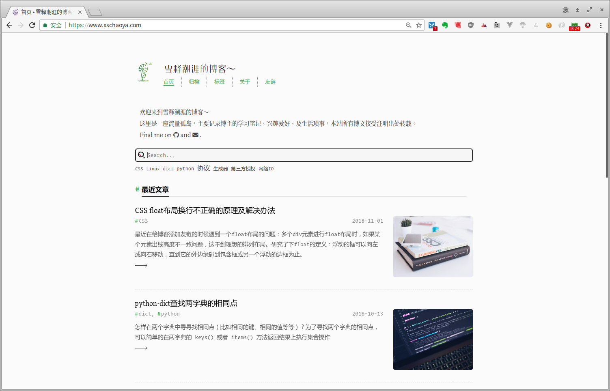

# dandelion

一个响应式[Hexo](http://hexo.io)个人博客主题

[Demo: https://xschaoya.com](https://xschaoya.com)




## 安装
1. 在hexo项目路径执行

    ```git
    $ git clone https://github.com/xueshichaoya/hexo-theme-dandelion.git　themes/dandelion
    ```

2. 在hexo路径下的`config.yml`文件中指定主题

    ```yml
    # theme: landscape
    theme: dandelion
    ```

3. 运行: `hexo generate` and `hexo server`


## 配置

详细配置请参考`_config.yml`


## License
MIT
